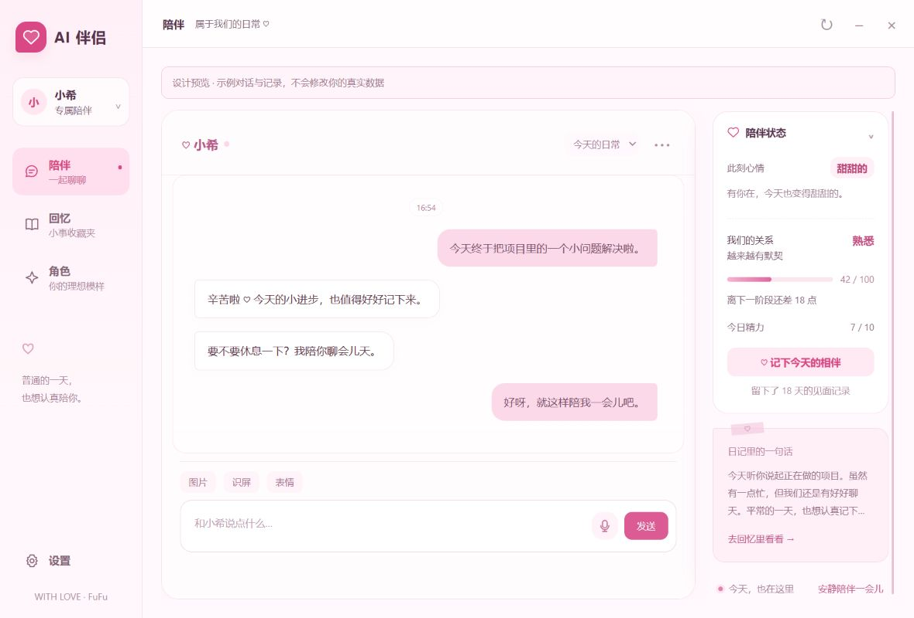
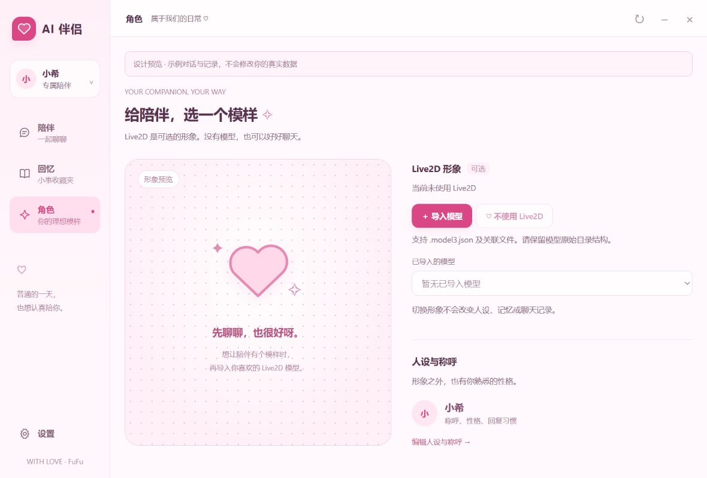

# AI 伴侣 · AI Companion

把普通的一天，聊成值得记住的日常。♡

一款面向 Windows 的 AI 桌面陪伴应用。以聊天为起点，把记忆、日记、关系成长和可配置的角色连接起来；喜欢有形象的陪伴时，再导入自己的 Live2D 模型。



> 当前为未发布的界面重构版本，软件包版本仍为 1.3.0。截图使用隔离示例数据；真实 Electron 桌面回归、干净安装与新安装包验收尚未完成。

## 一起聊聊，慢慢熟悉

| 入口 | 可以做什么 |
| --- | --- |
| **陪伴** | 直接进入完整聊天；在旁边查看当前心情、关系与相伴记录，打卡，暂停或恢复主动陪伴。 |
| **回忆** | 翻阅已经保存的记忆，置顶重要小事；切到「日记与时光」，查看日记、日常片段和关系里程碑。 |
| **角色** | 查看当前角色，导入、切换或停用 Live2D 形象；前往设置调整名称、性格和称呼。 |
| **设置** | 按连接、角色、陪伴、记忆、聊天、声音、应用七类管理现有功能。 |

聊天保留已有的会话切换、新建和清空，以及图片附件、识屏附件、贴纸、语音输入、停止与重试。消息菜单提供引用、复制、收藏、撤回、语音文字查看和表情库操作；设置里可以检索与导出记录。

语音输入、语音输出和图片理解取决于所配置的服务及其能力。主动互动、记忆提取、心情与好感使用项目现有的规则和 AI 配置；页面呈现实际保存的状态，没有记录时显示空状态。

## 角色由你决定



**角色设定与 Live2D 形象独立。** 修改名字、性格和称呼在「设置 → 角色」完成；导入或切换模型不会替换人设，也不会清空记忆或聊天记录。

- 没有模型时，文字聊天、记忆、日记、好感与已配置的语音功能照常使用。
- 想添加形象时，在「角色」点击「导入模型」，选择自己的 `.model3.json` 文件，并保留关联资源的目录结构。
- 导入的模型可以在列表中切换。「不使用 Live2D」只停用形象，保留已导入文件和陪伴记录。
- 主界面的模型预览集中在「角色」页；独立桌宠是可选的桌面表现方式。

此源码预览包不附带角色模型、原有贴纸或角色头像图标；构建图标使用通用爱心。Live2D Core 运行库需自行从官方 SDK 获取，见[可选运行库安装](docs/runtime-setup.md)。本地 `models/` 目录继续排除。导入要求和保存位置见[模型使用说明](docs/model-import.md)。

## 开始使用

安装 Node.js 与 pnpm 后，在项目目录执行（当前锁文件尚待同步，预览版安装允许重新解析依赖）：

```powershell
pnpm install --no-frozen-lockfile
npm run start
```

启动后进入陪伴主界面。在「设置 → 连接」填写 AI 服务地址、访问密钥和模型，测试连接后保存。需要语音时，再到「声音」配置语音输入或回复服务。Live2D 不属于必填配置。

主界面的关闭按钮将窗口收起到托盘；完全退出可以使用托盘菜单或「设置 → 应用」。

### 开发命令

```powershell
npm test        # 核心逻辑与隔离回归检查
npm run start   # 启动开发应用
npm run pack    # 生成 Windows 应用目录
npm run dist    # 生成 Windows NSIS 安装程序
```

项目使用 Electron、PIXI、pixi-live2d-display 和普通 JavaScript。当前依赖锁文件、Electron 版本与打包路径还需要统一；这些命令是开发入口，不代表干净安装或打包已经通过。具体待办见[发布检查清单](docs/release-checklist.md)。

## 数据与服务

角色配置、聊天、记忆和日常记录通过 Electron 的 `userData` 保存在本机。使用远程对话或语音服务时，相应内容会发送给配置的服务提供方；启用活动或屏幕感知后，得到的上下文也可能进入 AI 请求。可以在「设置 → 陪伴」调整这些功能。

配置导出会清除 API 密钥字段，但其他配置和聊天备份仍可能包含个人信息。当前并不承诺所有本地数据均已加密；首次使用的感知说明与凭据存储仍列在发行验收中。

## 项目结构

```text
home.html / chat.html / panel.html  主界面、完整聊天、分组设置
preload*.js                        窗口与主进程之间的接口
src/renderer/                      样式、主界面与可选形象预览
src/main/
  home.js                          陪伴状态与回忆快照
  ai-config.js / prompt.js          角色配置与对话提示
  memory.js / life-memory.js        记忆、日记和日常片段
  mood.js / affection.js            心情与关系状态
  model-manager.js                 可选模型导入、切换与停用
  tts.js / tts-edge.js              语音回复
  storage.js / sessions.js          本地保存与会话
scripts/                           开发、测试和打包入口
docs/                              产品说明、截图与发行记录
```

界面取舍参考了 AIRI、Open-LLM-VTuber、SillyTavern 和 Kindroid 的官方产品文档，采用聊天优先、角色配置与可选视觉分开的结构。具体参考与实现映射见[产品说明](docs/product-design-v1.md)。

## 后续工作

- 完成真实 Windows 桌面回归、依赖整理和当前源码的安装包验收。
- 完善首次配置、感知控制和错误恢复体验。
- 补充记忆来源、修正和数据管理能力。
- 明确源码许可与其余素材的分发范围，录制实际操作 Demo。

版本改动见 [CHANGELOG](CHANGELOG.md)。源码许可证尚待确定；第三方运行时的版权与许可声明保留，角色素材按各自的授权使用。

## Author

**FuFu**
